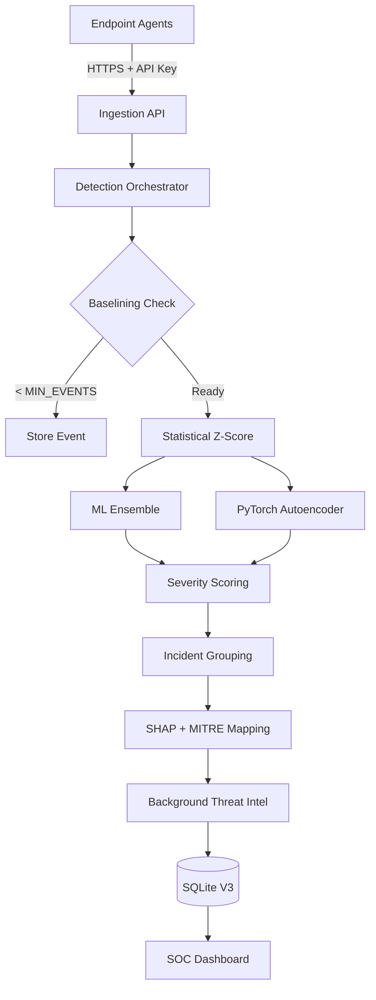

# AI-Sentinel V3: Enterprise-Grade SIEM Anomaly Detection Platform

"An Open-Source, Explainable Alternative to Enterprise SIEM Anomaly Detection"

## Overview
AI-Sentinel V3 is a production-ready, open-source SIEM platform designed to emulate core capabilities seen in enterprise tools like Splunk and Microsoft Sentinel. It provides real-time detection of anomalies in SSH authentication logs using a multi-layer Machine Learning pipeline (Statistical Baselining, Ensemble Models, and Autoencoders).

A key feature of AI-Sentinel is **Explainability & Threat Intelligence**. The platform utilizes SHAP to interpret model decisions, composite severity scoring, and AbuseIPDB enrichment. These interpretations generate human-readable threat narratives, mapping incidents to MITRE ATT&CK techniques with confidence scores.

## V3 Features
- **Centralized API & Event Processing**: FastAPI ingestion layer with TLS enforcement, JWT-based authentication, Role-Based Access Control (RBAC), and payload validation.
- **Persistent ML Models & Drift Detection**: Models are persisted to disk, handle cold-starts gracefully, and feature drift is tracked daily using Population Stability Index (PSI).
- **Incident Management**: Automatically groups related anomalies across devices and IPs into manageable incidents using a configurable time window.
- **7-Page SOC Dashboard**: Comprehensive Streamlit interface featuring Live Alerts, Threat Intel Lookups, Device Behavior, Model Analytics, Analytics Trends, and Admin Management. Includes downloadable PDF security reports.
- **Background Jobs**: Built-in APScheduler for metrics pre-aggregation, device offline detection, geo-resolution, Threat Intel caching, and data retention cleanup.
- **Endpoint Agents**: Standalone Python endpoint agent (`linux_agent.py`) and Windows simulator that handle exponential HTTP backoff and periodic heartbeats.

## Quick Start (Local Development)

### 1. Install Dependencies
```bash
pip install -r requirements.txt
```

### 2. Launch the Server & Dashboard
Start the central API collector:
```bash
python -m uvicorn server:app --host 0.0.0.0 --port 8000
```
In a new terminal window, start the V3 web interface:
```bash
python -m streamlit run ai_sentinel/ui/dashboard.py
```
*The dashboard will spawn at `http://localhost:8501`. Create an account on the "Login" page or use the agent simulator to generate a default admin account.*

### 3. Connect a Device (Windows Simulator)
To test the pipeline locally on Windows, run the all-in-one simulator script. It handles token registration, spawns a dummy API connection, and creates `dummy_auth.log`.
```bash
python windows_agent_simulator.py
```
**To test detection, open `dummy_auth.log` in Notepad, paste this 10 times in a row, and save.**
```text
Mar 20 20:05:00 Test-PC sshd[123]: Failed password for admin from 10.0.0.99 port 5555
```
Watch the Live Alerts dashboard update instantly!

## Production Deployment (Docker Compose)

The easiest way to run AI-Sentinel V3 in production is using Docker Compose.

1. **Configure Environment Variables:**
   Copy `.env.example` to `.env` and fill out your specific variables (JWT secrets, AbuseIPDB keys, TLS flags, etc.):
   ```bash
   cp .env.example .env
   ```

2. **Start Services:**
   Run the platform in detached mode:
   ```bash
   docker compose up -d
   ```
   This will spin up:
   - `ai-sentinel-api` on port `8000`
   - `ai-sentinel-dashboard` on port `8501`
   - `ai-sentinel-agent-sim` (idle by default)

3. **Connecting Real Devices (Linux/WSL Install):**
   1. Go to the **Connect My Device** page in your dashboard.
   2. Copy the generated one-time `curl` configuration string.
   3. Paste it directly into the target Linux server's terminal. It will automatically install the daemon and systemd service.

## Architecture Data Flow

