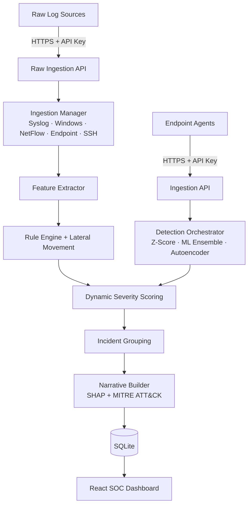

<div align="center">

# 🛡️ LSAD

### Local Security & Anomaly Detection — open-source, explainable, built to run anywhere.

**Real-time, multi-source log detection with ML ensembles, SHAP explainability, and human-readable threat narratives — no LLM API keys required.**

<br/>

[](LICENSE)
[](https://www.python.org/)
[](https://fastapi.tiangolo.com/)
[](frontend/)
[](tests/test_v4_smoke.py)
[](https://github.com/tsmanral/LSAD/stargazers)

</div>

---

## Why LSAD?

Enterprise SIEMs like Splunk and Microsoft Sentinel are powerful — and heavy, expensive, and opaque. Lightweight consumer tools watch the network but have no real detection intelligence. **LSAD fills the gap**: a self-hostable SOC platform that explains *why* every alert fired.

- 🧠 **Multi-layer ML detection** — statistical baselining (Z-score), ensemble models (Isolation Forest, LOF, One-Class SVM), and a PyTorch autoencoder, with drift tracking via Population Stability Index.
- 🔍 **Explainable by design** — SHAP feature attribution, composite severity scoring with a plain-English breakdown per alert, and MITRE ATT&CK technique mapping with confidence scores.
- 🌐 **Multi-source ingestion** — parsers for SSH auth logs, Syslog, Windows Events, network flows (NetFlow / firewall), and endpoint telemetry through a single raw-log API.
- 📖 **Threat narratives without an LLM** — a pure-template case-file generator turns correlated anomalies into readable incident stories. Zero API keys, zero recurring cost.
- 🚨 **Detection rules that matter** — brute force, credential stuffing, port scans, exfiltration, LOLBin abuse, persistence, and lateral movement, all with tunable thresholds and analyst feedback loops.
- 📊 **Full SOC dashboard** — modern React (Vite) command center with live threat feed, incident drill-down, multi-source health, threat intel (AbuseIPDB), model analytics, device behavior, feedback & threshold tuning, and admin management with RBAC + JWT auth. A legacy Streamlit interface is also included.

## Quick Start

> Requires **Python 3.12** (scikit-learn is not yet compatible with 3.14 — check versions with `py -0` on Windows).

```bash
# 1. Clone and set up
git clone https://github.com/tsmanral/LSAD.git
cd LSAD
py -3.12 -m venv venv            # Linux/macOS: python3.12 -m venv venv
venv/Scripts/pip install -r requirements.txt   # Linux/macOS: venv/bin/pip

# 2. Start the API server (creates the database on first launch)
venv/Scripts/python -m uvicorn server:app --host 0.0.0.0 --port 8000

# 3. In a second terminal, start the React dashboard
cd frontend
npm install
npm run dev
```

Open **http://localhost:5173**, register an account, and connect your first device from the **Connect Device** page — it generates a one-line install command for any Linux host. The Linux agent auto-detects whether the system uses `/var/log/auth.log` or `journalctl`. On Windows, `python windows_agent_simulator.py` spins up a local test agent.

To validate the full pipeline (parsers, rules, severity, narratives, DB, scheduler):

```bash
venv/Scripts/python tests/test_v4_smoke.py    # expected: 27/27 passed
```

### Docker (production)

```bash
cp .env.example .env    # set JWT secrets, TLS flags, optional AbuseIPDB key
docker compose up -d
```

This starts the API (`:8000`), the legacy Streamlit dashboard (`:8501`), and an idle agent simulator. A versioned Docker image is also published to [GHCR](https://github.com/tsmanral/LSAD/pkgs/container/lsad) on every release.

## Ingesting Logs

Any log line from any source, through one endpoint:

```bash
curl -X POST http://localhost:8000/api/events/raw \
  -H "Content-Type: application/json" \
  -H "X-Device-Id: <device-id>" -H "X-Api-Key: <api-key>" \
  -d '{"lines": [{"raw_line": "Jan  5 12:34:56 server sudo[999]: root : COMMAND=/bin/bash", "source_hint": "syslog"}]}'
```

Per-source ingestion health is available at `GET /api/events/stats`.

## Architecture



A deeper technical walkthrough lives in [ARCHITECTURE.md](ARCHITECTURE.md), and the platform's design evolution is documented in [docs/V3_VS_V4_EVOLUTION.md](docs/V3_VS_V4_EVOLUTION.md).

Background jobs (APScheduler) handle cross-source correlation, lateral-movement scans, metrics pre-aggregation, geo-resolution, threat-intel caching, drift detection, and data retention — no external queue or cron required.

## Project Structure

```
ai_sentinel/        Core platform: auth, ingestion, detection, storage, scheduler, legacy UI
frontend/           React (Vite + TypeScript) SOC dashboard
tests/              Test suite + end-to-end smoke tests
datasets/           Synthetic SSH log generator for local experimentation
fleet_simulator.py  Multi-device fleet traffic simulator
windows_agent_simulator.py  All-in-one Windows test agent
windows_live_agent.py       Live Windows event agent
server.py           FastAPI entry point
```

## Contributing

Contributions are welcome! Read the [Contributing Guide](CONTRIBUTING.md) for the development setup, coding standards, and pull-request process. The short version:

1. **Fork** the repo and create a feature branch from `main` (`git checkout -b feature/my-improvement`).
2. Make your change and run the smoke tests (`python tests/test_v4_smoke.py`).
3. Open a **pull request** against `main` with a clear description.

`main` is the only long-lived branch — all work lands through short-lived feature branches and PRs. Bug reports and feature ideas are welcome in [Issues](https://github.com/tsmanral/LSAD/issues).

This project follows the [Contributor Covenant Code of Conduct](CODE_OF_CONDUCT.md). To report a vulnerability privately, see the [Security Policy](SECURITY.md) — never open a public issue for security findings.

## License

Distributed under the **GNU Affero General Public License v3.0**. See [LICENSE](LICENSE) for details.

## Author

**Tribhuwan Singh**

[](https://github.com/tsmanral)
[](mailto:tribhuwan.singh1108@gmail.com)

## Contributors

Thanks to everyone who has contributed to LSAD:

<a href="https://github.com/tsmanral/LSAD/graphs/contributors">
  
</a>

---

<div align="center">
⭐ If LSAD is useful to you, consider starring the repo — it helps the project reach more people.
</div>
