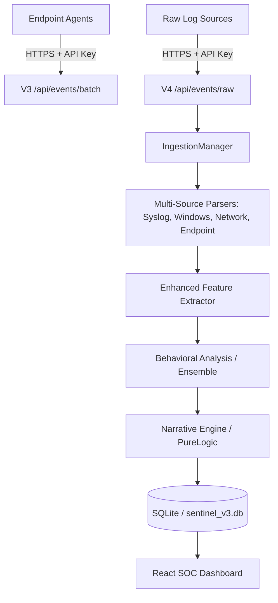

# AI-Sentinel V4: AI-Native Security Log Agent

AI-Sentinel is an advanced, offline-first SIEM platform designed for enterprise-grade threat detection and behavioral analysis.

## Quick Start

### 1. Backend Setup (FastAPI + SQLite)
```bash
# Install dependencies
pip install -r requirements.txt

# Start the server (Port 8000)
$env:PYTHONPATH = (Get-Location).Path
python server.py
```

### 2. Frontend Setup (React + Vite)
```bash
cd frontend

# Install dependencies
npm install

# Launch the dashboard (Port 5173)
npm run dev
```
*The dashboard will spawn at `http://localhost:5173`. Log in with `testuser` / `testuser` for mock data. For real testing, register a new account and connect a device.*

### 3. Connect a Device (Windows Simulator)
To test the pipeline locally on Windows:
```bash
python windows_agent_simulator.py
```

### 4. Connect a Linux Device
Run this command in your Linux/WSL terminal (replace `<TOKEN>` and `<IP>`):
```bash
curl -s http://<WINDOWS_IP>:8000/static/installer_linux.sh | sudo bash -s -- --token <TOKEN> --server http://<WINDOWS_IP>:8000
```
*Note: The V4 agent automatically detects if your system uses traditional `/var/log/auth.log` or modern `journalctl` and switches sources automatically.*

---

## 🛡️ Demo Guide: Live Threat Detection

Use these test cases to demonstrate real-time ingestion and behavioral analysis on the dashboard.

### **Test Case 1: Privilege Escalation Attempt**
Run an unauthorized `sudo` command on the Linux host:
```bash
sudo ls /root

sudo journalctl -u ai-sentinel-agent -f
```
*Check **Command Center** → "Live Threat Feed" or the **Live Event Stream** page. You should see a `sudo_command` event from your device within 2 seconds.*

### **Test Case 2: Brute Force Simulation**
Attempt to switch to a non-existent user multiple times:
```bash
sudo hacker_alpha
# (Enter random password 3 times)
```
*The dashboard will flag these as `ssh_failed_password` and eventually group them into a "Brute Force" incident.*

Trigger a burst of activity to see the 2-second flush or 50-event batch logic:
```bash
for i in {1..10}; do sudo non_existent_command_$i; done
```
*Note: The V4 agent flushes data every 2 seconds for high-responsiveness demos.*

---

## 🧹 Clean Slate (Reset for Demo)

To completely remove the agent and start fresh for a new demo:

### **1. Wipe Linux Host**
Run these on the Linux machine:
```bash
sudo systemctl stop ai-sentinel-agent
sudo systemctl disable ai-sentinel-agent
sudo rm -rf /opt/ai-sentinel-agent/
sudo rm -rf /etc/ai-sentinel-agent/
sudo rm /etc/systemd/system/ai-sentinel-agent.service
sudo systemctl daemon-reload
```

### **2. Reset Dashboard Data**
1. Go to **Multi-Source** tab.
2. Click the **Trash** icon next to your device to wipe its history (Events, Anomalies, Incidents) from the database.
3. Generate a new token in the **Connect Device** tab for the fresh install.

---

## Architecture Data Flow
...



## V3 vs V4 Changes
| Feature | V3 Architecture | V4 Architecture |
| :--- | :--- | :--- |
| **Ingestion** | Single-source (SSH/Windows) | Modular Multi-source (Syslog, Network, Endpoint) |
| **Logic** | Heuristic Rules | Narrative Engine (PureLogic V2) |
| **Database** | Flat SQLite Schema | Relational & Metrics-Optimized |
| **UI** | Basic Monitoring | Advanced SOC HUD with Drift & SHAP |
