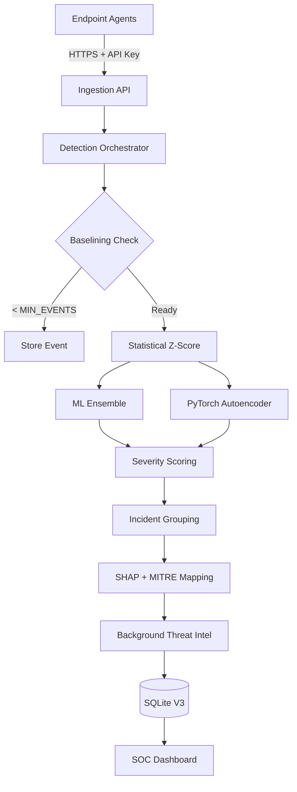
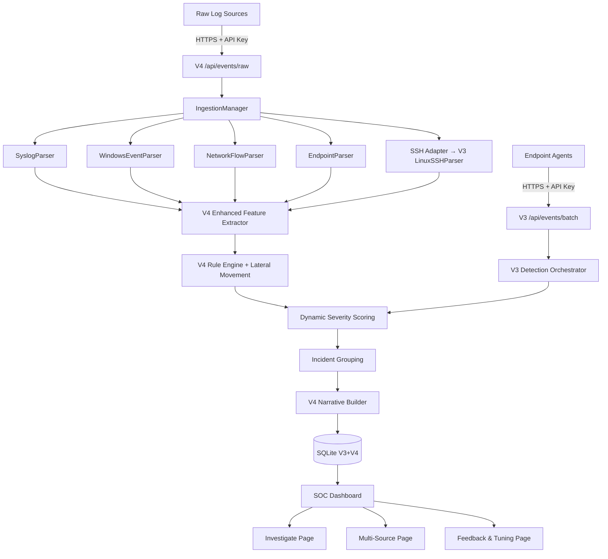

# AI-Sentinel V3: Enterprise-Grade SIEM Anomaly Detection Platform

"An Open-Source, Explainable Alternative to Enterprise SIEM Anomaly Detection"

## Overview
AI-Sentinel V3 is a production-ready, open-source SIEM platform designed to emulate core capabilities seen in enterprise tools like Splunk and Microsoft Sentinel. It provides real-time detection of anomalies in SSH authentication logs using a multi-layer Machine Learning pipeline (Statistical Baselining, Ensemble Models, and Autoencoders).

A key feature of AI-Sentinel is **Explainability & Threat Intelligence**. The platform utilizes SHAP to interpret model decisions, composite severity scoring, and AbuseIPDB enrichment. These interpretations generate human-readable threat narratives, mapping incidents to MITRE ATT&CK techniques with confidence scores.

## V3 Features
- **Centralized API & Event Processing**: FastAPI ingestion layer with TLS enforcement, JWT-based authentication, Role-Based Access Control (RBAC), and payload validation.
- **Persistent ML Models & Drift Detection**: Models are persisted to disk, handle cold-starts gracefully, and feature drift is tracked daily using Population Stability Index (PSI).
- **Incident Management**: Automatically groups related anomalies across devices and IPs into manageable incidents using a configurable time window.
- **7-Page SOC Dashboard**: Comprehensive Streamlit interface featuring Live Alerts, Threat Intel Lookups, Device Behavior, Model Analytics, Analytics Trends, and Admin Management. Includes downloadable PDF security reports.
- **Background Jobs**: Built-in APScheduler for metrics pre-aggregation, device offline detection, geo-resolution, Threat Intel caching, and data retention cleanup.
- **Endpoint Agents**: Standalone Python endpoint agent (`linux_agent.py`) and Windows simulator that handle exponential HTTP backoff and periodic heartbeats.

## Quick Start (Local Development)

### 1. Install Dependencies
```bash
pip install -r requirements.txt
```

### 2. Launch the Server & Dashboard
Start the central API collector:
```bash
python -m uvicorn server:app --host 0.0.0.0 --port 8000
```
In a new terminal window, start the V3 web interface:
```bash
python -m streamlit run ai_sentinel/ui/dashboard.py
```
*The dashboard will spawn at `http://localhost:8501`. Create an account on the "Login" page or use the agent simulator to generate a default admin account.*

### 3. Connect a Device (Windows Simulator)
To test the pipeline locally on Windows, run the all-in-one simulator script. It handles token registration, spawns a dummy API connection, and creates `dummy_auth.log`.
```bash
python windows_agent_simulator.py
```
**To test detection, open `dummy_auth.log` in Notepad, paste this 10 times in a row, and save.**
```text
Mar 20 20:05:00 Test-PC sshd[123]: Failed password for admin from 10.0.0.99 port 5555
```
Watch the Live Alerts dashboard update instantly!

## Production Deployment (Docker Compose)

The easiest way to run AI-Sentinel V3 in production is using Docker Compose.

1. **Configure Environment Variables:**
   Copy `.env.example` to `.env` and fill out your specific variables (JWT secrets, AbuseIPDB keys, TLS flags, etc.):
   ```bash
   cp .env.example .env
   ```

2. **Start Services:**
   Run the platform in detached mode:
   ```bash
   docker compose up -d
   ```
   This will spin up:
   - `ai-sentinel-api` on port `8000`
   - `ai-sentinel-dashboard` on port `8501`
   - `ai-sentinel-agent-sim` (idle by default)

3. **Connecting Real Devices (Linux/WSL Install):**
   1. Go to the **Connect My Device** page in your dashboard.
   2. Copy the generated one-time `curl` configuration string.
   3. Paste it directly into the target Linux server's terminal. It will automatically install the daemon and systemd service.

## Architecture Data Flow


---

## V4 Upgrade (feature/v4-upgrade branch)

AI-Sentinel V4 extends the platform into a multi-source, understanding-centric SIEM. V3 remains fully backward compatible.

### What's New in V4

| Layer | Addition |
|---|---|
| **Ingestion** | Parsers for Syslog, Windows Events, Network Flows (NetFlow/firewall), and Endpoint telemetry |
| **API** | `POST /api/events/raw` — ingest any raw log line; `GET /api/events/stats` — per-source health |
| **Detection** | 8 new V4 rules: brute force, credential stuffing, port scan, exfiltration, LOLBin, persistence, lateral movement |
| **Severity** | Deterministic additive formula with plain-English explanation per alert |
| **Narrative** | Pure-template case file generator — no LLM, no API key required |
| **UI** | 3 new pages: **Investigate**, **Multi-Source**, **Feedback & Threshold Tuning** |
| **DB** | `002_v4_schema.sql` adds `alerts_feedback` and `ingestion_stats` tables |
| **Scheduler** | 3 new background jobs: cross-source correlation, lateral movement scan, ingestion health |

---

## Quick Start — V4 (Local Development)

> **Requires Python 3.12.** Python 3.14 (the system default) is incompatible with scikit-learn.
> Check available versions with `py -0`.

### 1. Create a Python 3.12 Virtual Environment

```bash
py -3.12 -m venv venv
```

### 2. Install Dependencies

```bash
.\venv\Scripts\pip install -r requirements.txt
```

> On Linux/macOS replace `.\venv\Scripts\` with `./venv/bin/`.

### 3. Apply the V4 Database Migration

Run this once after the initial `init_db()` call (which the server triggers automatically on first launch):

```bash
# Windows PowerShell
Get-Content ai_sentinel\storage\migrations\002_v4_schema.sql | .\venv\Scripts\python -c "import sys, sqlite3; conn = sqlite3.connect('data/sentinel.db'); conn.executescript(sys.stdin.read()); conn.commit(); print('V4 schema applied.')"
```

```bash
# Linux / macOS
sqlite3 data/sentinel.db < ai_sentinel/storage/migrations/002_v4_schema.sql
```

### 4. Run the V4 Smoke Test (27/27)

Validates every V4 module — parsers, ingestion manager, feature extractor, detection rules, severity scoring, narrative engine, DB CRUD, scheduler jobs, UI imports, and config keys:

```bash
# Windows PowerShell
.\venv\Scripts\python test_v4_smoke.py

# Linux / macOS
./venv/bin/python test_v4_smoke.py
```

**Expected output:**

```
────────────────────────────────────────────────────────────
  1. V4 Parser imports & basic parsing
────────────────────────────────────────────────────────────
  ✅  base_parser import
  ✅  SyslogParser (sudo line)
  ✅  WindowsEventParser (4625 pipe-delimited)
  ✅  NetworkFlowParser (NetFlow CSV)
  ✅  NetworkFlowParser (iptables DENY)
  ✅  EndpointParser (suspicious cmdline + unusual parent)
  ...
════════════════════════════════════════════════════════════
  V4 SMOKE TEST RESULTS: 27/27 passed
  🎉  All V4 tests passed!
════════════════════════════════════════════════════════════
```

> The Streamlit `WARNING: No runtime found` messages are expected when running outside the browser — they are not failures.

### 5. Launch the V4 FastAPI Server

```bash
# Windows PowerShell
$env:PYTHONPATH = (Get-Location).Path
.\venv\Scripts\python -m uvicorn server:app --host 0.0.0.0 --port 8000 --reload

# Linux / macOS
PYTHONPATH=$(pwd) ./venv/bin/uvicorn server:app --host 0.0.0.0 --port 8000 --reload
```

### 6. Launch the V4 Dashboard

The `PYTHONPATH` must point to the project root so `ai_sentinel` is importable:

```bash
# Windows PowerShell
$env:PYTHONPATH = (Get-Location).Path
.\venv\Scripts\streamlit run ai_sentinel/ui/dashboard.py --server.port 8501

# Linux / macOS
PYTHONPATH=$(pwd) ./venv/bin/streamlit run ai_sentinel/ui/dashboard.py --server.port 8501
```

Dashboard opens at **`http://localhost:8501`**. Log in with your existing account or register a new one.

**V4 sidebar navigation:**

| Page | Description |
|---|---|
| 🚨 Live Alerts | Real-time anomaly feed with V4 narratives and FP buttons |
| 📊 Analytics | Event trends, severity breakdown |
| 🖥️ Device Behavior | Per-device analytics |
| 🧠 Model Analytics | Model registry, drift detection |
| 🔍 Threat Intel | AbuseIPDB reputation data |
| 🔌 Connect My Device | One-time token generation |
| **🔎 Investigate** *(V4)* | Case file generator, entity timeline, cross-source panel |
| **🌐 Multi-Source** *(V4)* | Ingestion health, cross-source IP tracker, network/endpoint summaries |
| **📊 Feedback** *(V4)* | FP pattern review, FP rate by source, threshold tuning |
| 🛠️ Admin | User management, system status |

### 7. Test the V4 Raw Log Ingestion API

```bash
# Register a device first, then ingest a raw syslog line:
curl -X POST http://localhost:8000/api/events/raw \
  -H "Content-Type: application/json" \
  -H "X-Device-Id: <your-device-id>" \
  -H "X-Api-Key: <your-api-key>" \
  -d '{"lines": [{"raw_line": "Jan  5 12:34:56 server sudo[999]: root : COMMAND=/bin/bash", "source_hint": "syslog"}]}'
```

```bash
# Get ingestion stats by source type:
curl http://localhost:8000/api/events/stats \
  -H "X-Device-Id: <your-device-id>" \
  -H "X-Api-Key: <your-api-key>"
```

---

## V4 Architecture Data Flow


