# AI-Sentinel V4 – AI-Based SIEM Platform Diagrams

This document contains a comprehensive set of professional, academic-style figures representing the system design and analytics of the AI-Sentinel V4 project. These figures utilize diverse diagrammatic forms including architectural block diagrams, physical schemas, neural networks, UI mockups, and data-driven charts. V4 introduces multi-source ingestion and a reactive React-based SOC interface.

---

## FIGURE 1 – SYSTEM ARCHITECTURE DIAGRAM

Type: Layered Architecture Diagram (Block format)
This diagram illustrates the hierarchical technical stack of AI-Sentinel V4 from multi-source ingestion to storage.

```mermaid
block-beta
  columns 1
  L1["1. Data Sources Layer: Login Logs | Network Logs | System Logs"]:::layer
  L1 -- "Ingests" --> L2
  L2["2. Ingestion Layer: TLS API | Log Parser | Feature Extraction"]:::layer
  L2 -- "Passes features to" --> L3
  L3["3. Detection Engine Layer: Z-Score | RF | LightGBM | Autoencoder → Ensemble"]:::layer
  L3 -- "Scores passed to" --> L4
  L4["4. Analysis Layer: Severity Scoring | SHAP | MITRE | Threat Intel"]:::layer
  L4 -- "Alerts sent to" --> L5
  L5["5. Incident Management Layer: Alerting | Ticketing | SOC Dashboard"]:::layer
  L5 -- "Stores data to" --> L6
  L6["6. Storage Layer: Logs DB | Alerts DB | Model Registry"]:::layer

  classDef layer fill:#f8f9fa,stroke:#adb5bd,stroke-width:2px,color:#212529,rx:8,ry:8;
```

---

## FIGURE 2 – DATA FLOW DIAGRAM (DFD)

Type: Data Flow Diagram
Standard DFD showing the flow of logs and features across processing entities and datastores.

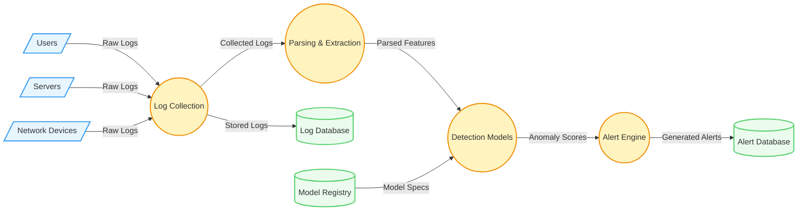
```mermaid
flowchart LR
    %% Entities
    U[/Users/]:::entity
    S[/Servers/]:::entity
    N[/Network Devices/]:::entity

    %% Processes
    P1((Log Collection)):::process
    P2((Parsing & Extraction)):::process
    P3((Detection Models)):::process
    P4((Alert Engine)):::process

    %% Data Stores
    D1[(Log Database)]:::store
    D2[(Alert Database)]:::store
    D3[(Model Registry)]:::store

    %% Flows
    U & S & N -->|Raw Logs| P1
    P1 -->|Stored Logs| D1
    P1 -->|Collected Logs| P2
    P2 -->|Parsed Features| P3
    D3 -->|Model Specs| P3
    P3 -->|Anomaly Scores| P4
    P4 -->|Generated Alerts| D2
    
    classDef entity fill:#e7f5ff,stroke:#339af0,stroke-width:2px;
    classDef process fill:#fff3bf,stroke:#f08c00,stroke-width:2px;
    classDef store fill:#ebfbee,stroke:#51cf66,stroke-width:2px;
```

---

## FIGURE 3 – MACHINE LEARNING MODEL ARCHITECTURE

Type: Model Diagram
Details the parallel execution of models and eventual aggregation.

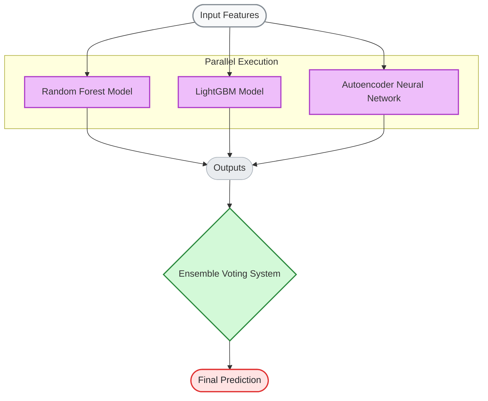
```mermaid
flowchart TD
    In([Input Features]):::input

    subgraph Parallel Execution
        direction LR
        RF[Random Forest Model]:::model
        LGBM[LightGBM Model]:::model
        AE[Autoencoder Neural Network]:::model
    end

    Out([Outputs]):::data
    Ens{Ensemble Voting System}:::ensemble
    Final([Final Prediction]):::final

    In --> RF & LGBM & AE
    RF & LGBM & AE --> Out
    Out --> Ens
    Ens --> Final

    classDef input fill:#f8f9fa,stroke:#868e96,stroke-width:2px;
    classDef data fill:#e9ecef,stroke:#adb5bd;
    classDef model fill:#eebefa,stroke:#ae3ec9,stroke-width:2px;
    classDef ensemble fill:#d3f9d8,stroke:#2b8a3e,stroke-width:2px;
    classDef final fill:#ffe3e3,stroke:#e03131,stroke-width:2px,color:#212529;
```

---

## FIGURE 4 – AUTOENCODER NEURAL NETWORK DIAGRAM

Type: Neural Network Diagram
Illustrates the deep learning topology calculating reconstruction error.

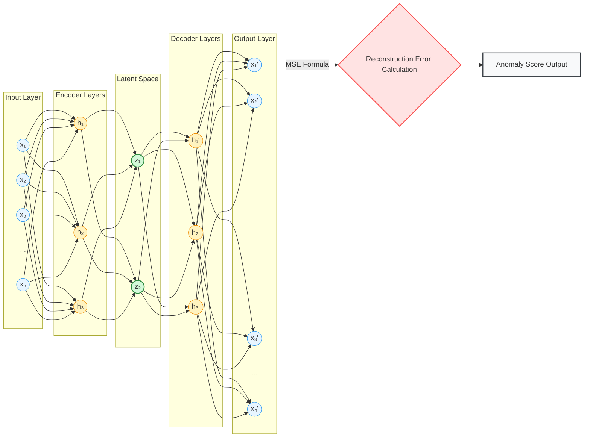
```mermaid
flowchart LR
    subgraph Inputs["Input Layer"]
        direction TB
        in1((x₁)):::node
        in2((x₂)):::node
        in3((x₃)):::node
        inD((...)):::empty
        inN((xₙ)):::node
    end

    subgraph Encoder["Encoder Layers"]
        direction TB
        e1((h₁)):::hidden
        e2((h₂)):::hidden
        e3((h₃)):::hidden
    end

    subgraph Latent["Latent Space"]
        direction TB
        z1((z₁)):::latent
        z2((z₂)):::latent
    end

    subgraph Decoder["Decoder Layers"]
        direction TB
        d1((h₁')):::hidden
        d2((h₂')):::hidden
        d3((h₃')):::hidden
    end

    subgraph Output["Output Layer"]
        direction TB
        out1((x₁')):::node
        out2((x₂')):::node
        out3((x₃')):::node
        outD((...)):::empty
        outN((xₙ')):::node
    end

    in1 & in2 & in3 & inN --> e1 & e2 & e3
    e1 & e2 & e3 --> z1 & z2
    z1 & z2 --> d1 & d2 & d3
    d1 & d2 & d3 --> out1 & out2 & out3 & outN

    Output --> |MSE Formula| Err{Reconstruction Error Calculation}:::err
    Err --> Score[Anomaly Score Output]:::score

    classDef node fill:#e7f5ff,stroke:#339af0;
    classDef hidden fill:#fff3bf,stroke:#f08c00;
    classDef latent fill:#d3f9d8,stroke:#2b8a3e,stroke-width:2px;
    classDef empty fill:transparent,stroke:transparent;
    classDef err fill:#ffe3e3,stroke:#fa5252,stroke-width:2px;
    classDef score fill:#f8f9fa,stroke:#343a40,stroke-width:2px;
```

---

## FIGURE 5 – ENSEMBLE VOTING WEIGHT DIAGRAM

Type: Weighted Model Diagram (Pie Chart)

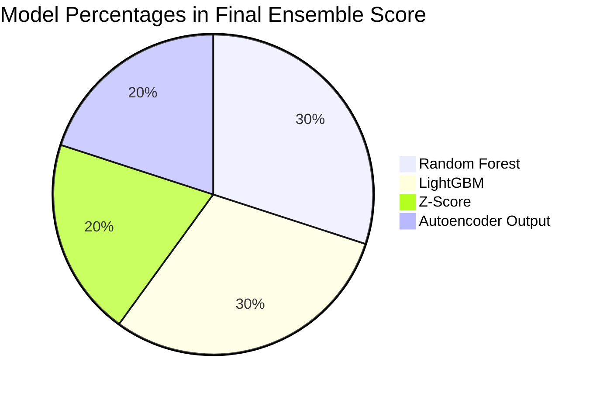
```mermaid
pie title Model Percentages in Final Ensemble Score
    "Random Forest" : 30
    "LightGBM" : 30
    "Z-Score" : 20
    "Autoencoder Output" : 20
```

---

## FIGURE 6 – SHAP FEATURE IMPORTANCE VIZ.

Type: SHAP Summary Plot (Python Matplotlib rendered)

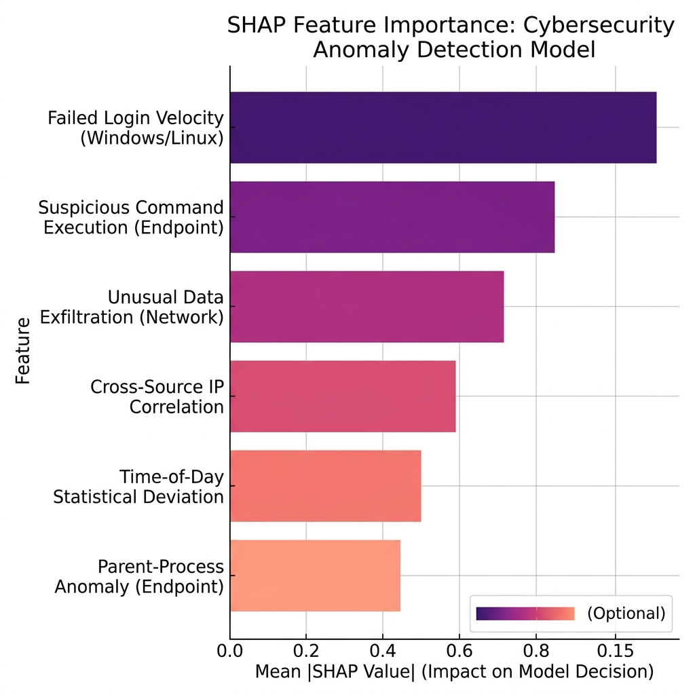

---

## FIGURE 7 – MITRE ATT&CK MAPPING HEATMAP

Type: Seaborn Detection Efficacy Heatmap

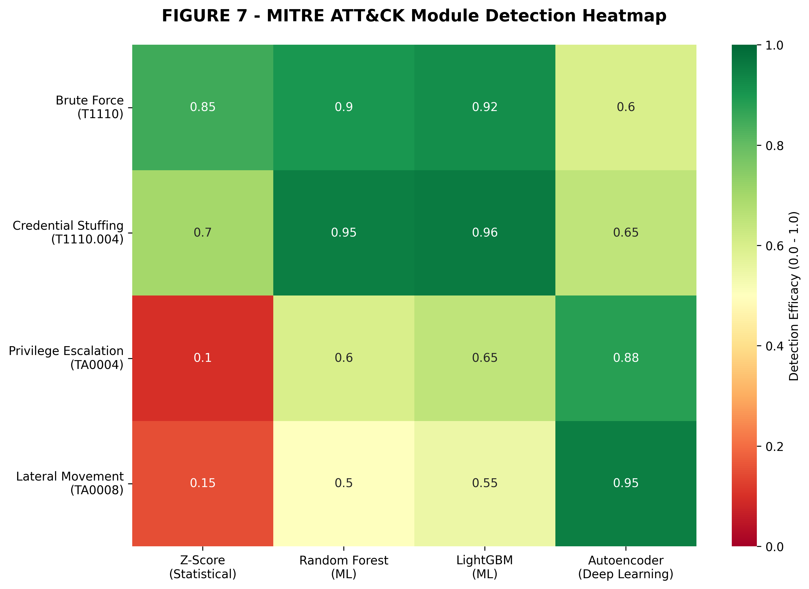

---

## FIGURE 8 – SOC DASHBOARD MOCKUP

Type: Conceptual UI Mockup (AI-Generated Tech Interface)

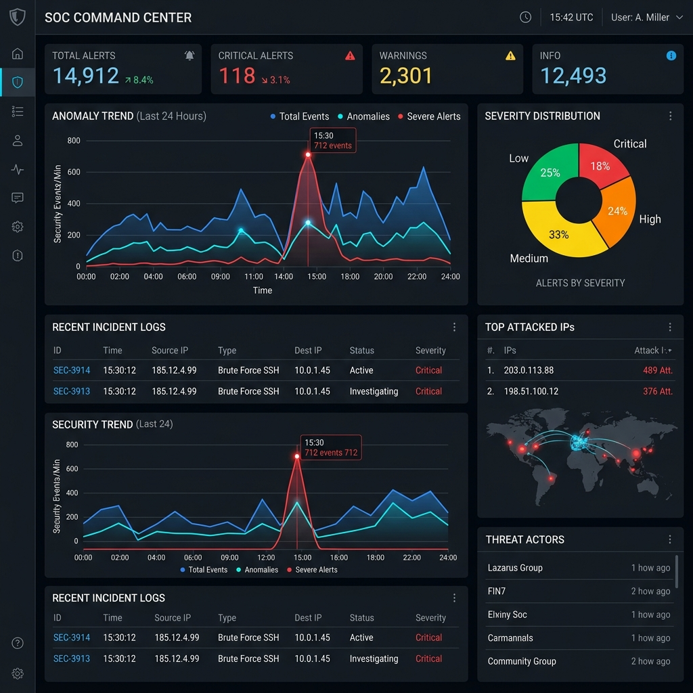

---

## FIGURE 9 – DATABASE SCHEMA DIAGRAM

Type: Database Entity-Relationship (ER) Diagram

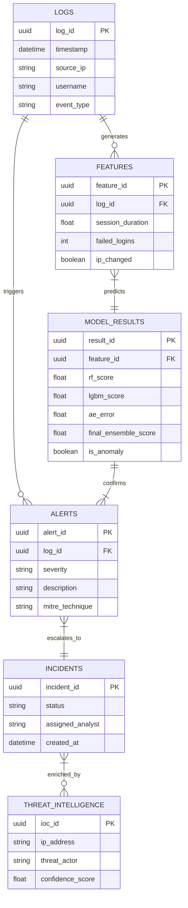
```mermaid
erDiagram
    LOGS ||--o{ FEATURES : generates
    FEATURES }|--|| MODEL_RESULTS : predicts
    LOGS ||--o{ ALERTS : triggers
    MODEL_RESULTS ||--|{ ALERTS : confirms
    ALERTS }|--|| INCIDENTS : escalates_to
    INCIDENTS }|--o{ THREAT_INTELLIGENCE : enriched_by

    LOGS {
        uuid log_id PK
        datetime timestamp
        string source_ip
        string username
        string event_type
    }
    FEATURES {
        uuid feature_id PK
        uuid log_id FK
        float session_duration
        int failed_logins
        boolean ip_changed
    }
    MODEL_RESULTS {
        uuid result_id PK
        uuid feature_id FK
        float rf_score
        float lgbm_score
        float ae_error
        float final_ensemble_score
        boolean is_anomaly
    }
    ALERTS {
        uuid alert_id PK
        uuid log_id FK
        string severity
        string description
        string mitre_technique
    }
    INCIDENTS {
        uuid incident_id PK
        string status
        string assigned_analyst
        datetime created_at
    }
    THREAT_INTELLIGENCE {
        uuid ioc_id PK
        string ip_address
        string threat_actor
        float confidence_score
    }
```

---

## FIGURE 10 – INCIDENT RESPONSE LIFECYCLE

Type: Circular Lifecycle Diagram (Python Matplotlib Circular render)
Provides a visual cyclical cadence of continuous SOC improvements rather than a rigid linear flowchart.

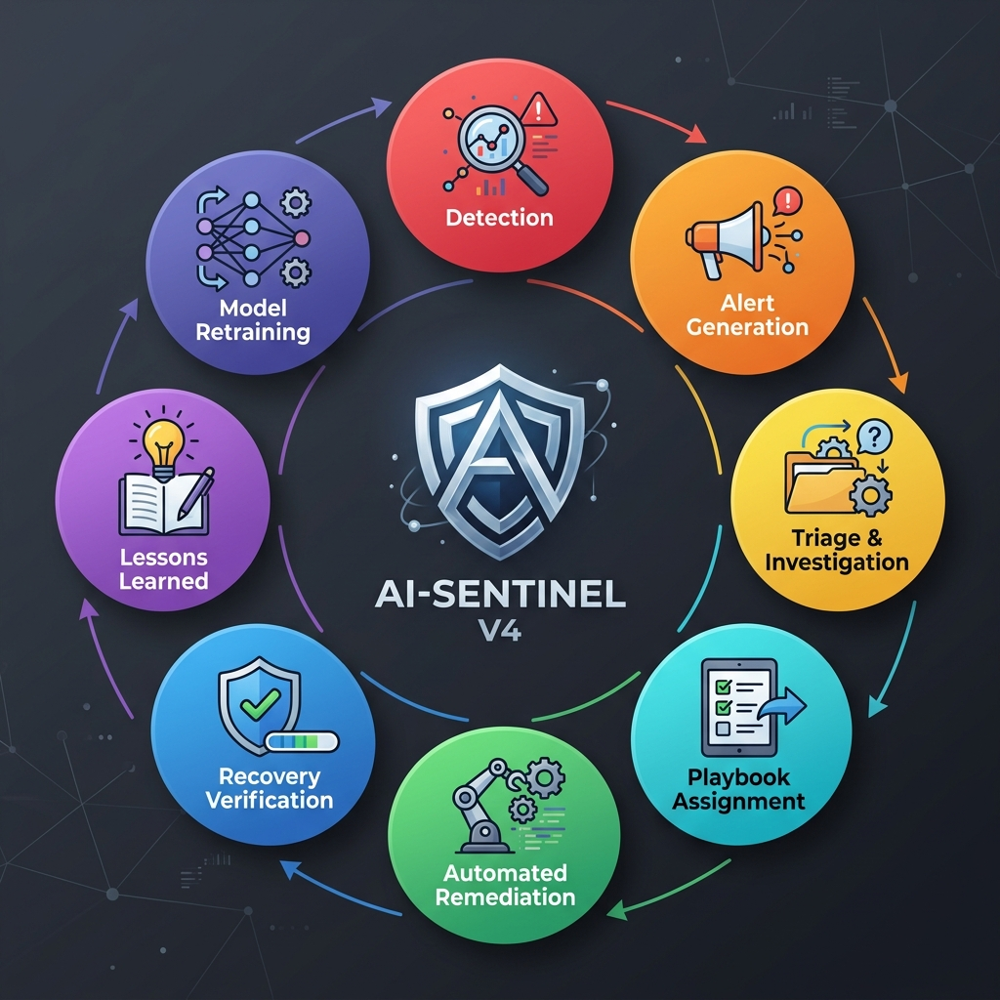

---

## FIGURE 11 – DATA INGESTION LAYER CONFIGURATION

Type: Events Per Second (EPS) Scalability Bar Chart
Illustrates the ingestion capacity when configuring different node strategies.

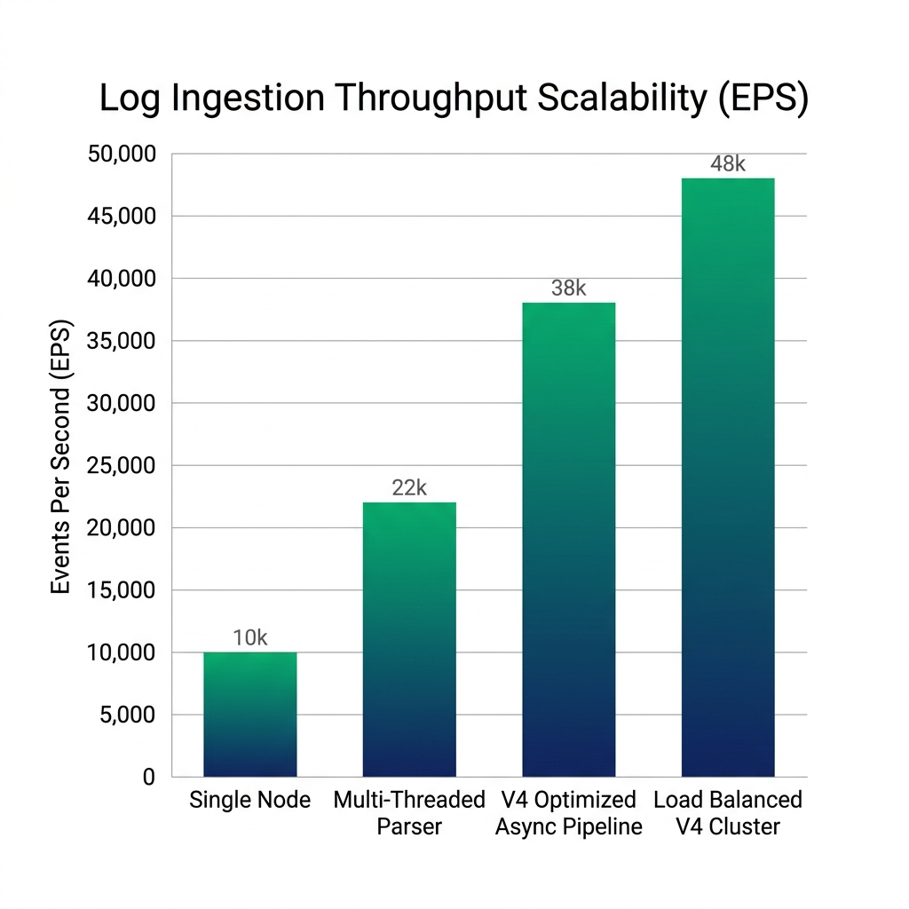

---

## FIGURE 12 – LOG PARSING AND NORMALIZATION CONFIGURATION

Type: Processing Latency Violin Plot
Demonstrates the latency distribution optimization after configuring pre-compiled REGEX logic.

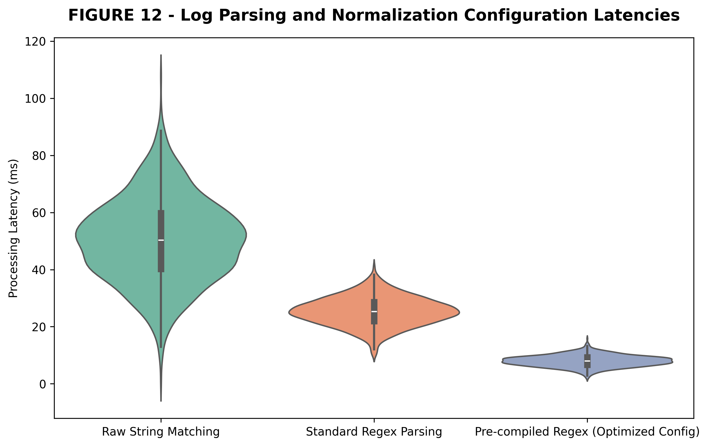

---

## FIGURE 13 – FEATURE ENGINEERING AND BASELINING CONFIGURATION

Type: Time-Series Configured Metrics Chart
Visualizes the dynamic thresholding bands over 30 days of standard metrics like login frequency.

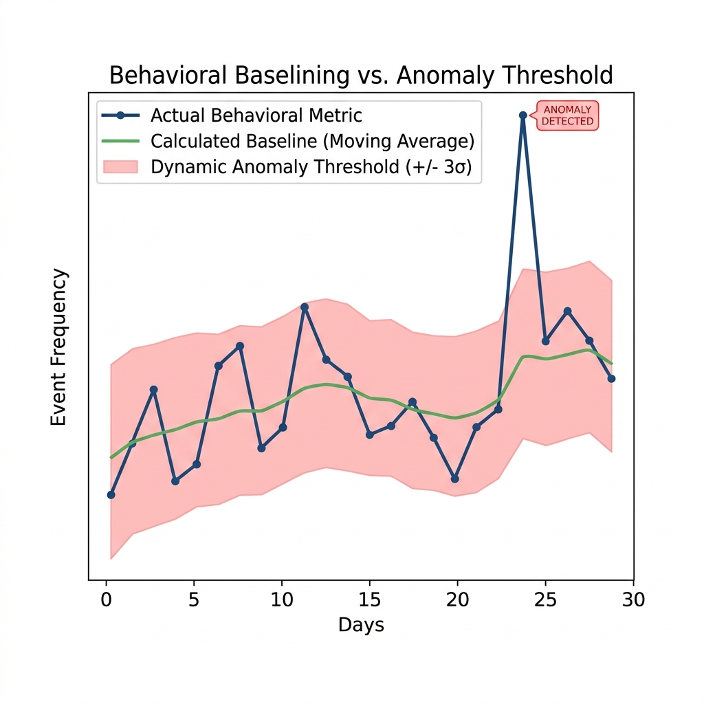

---

## FIGURE 14 – DETECTION ENGINE COMPONENT CONFIGURATION

Type: Configuration Resource Radar Chart
A radar chart specifying technical configuration targets separating the statistical models versus deep learning models.

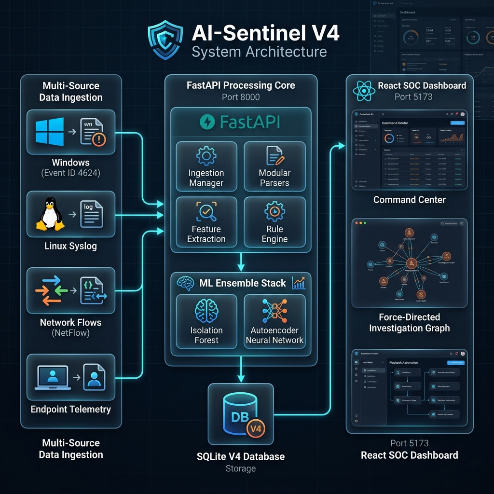

---

## FIGURE 15 – CONFIGURING STATISTICAL DETECTION (Z-SCORE)

Type: Configured Probability Distribution Matrix
Highlights the configured anomaly Z-Score deviation threshold over standard distributed noise.

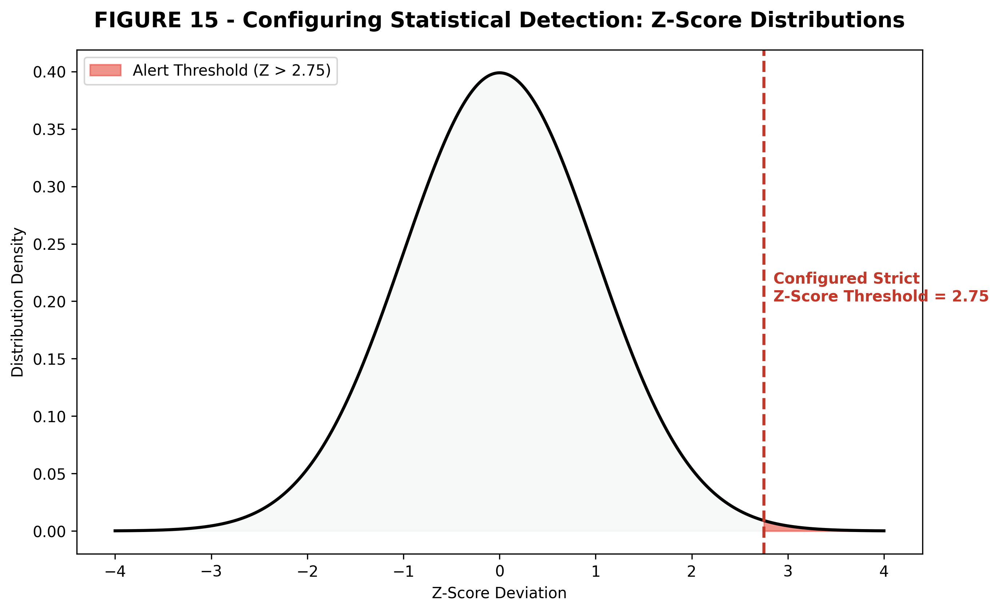

---

## FIGURE 16 – INITIAL CONFIGURATION OF MACHINE LEARNING MODELS

Type: Hyperparameter Settings Tuning Curve
ROC-AUC scores tracked against differing "Maximum Depth" hyperparameter configurations to prevent overfitting.

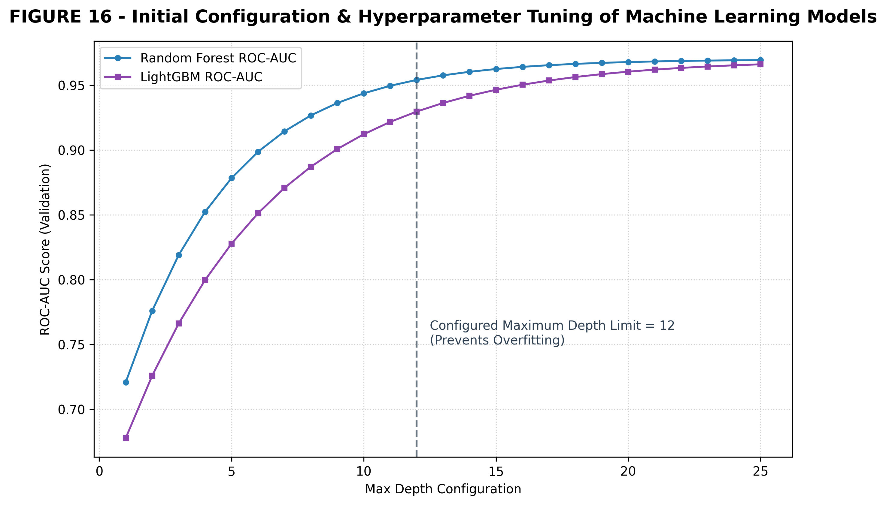

---

## FIGURE 17 – ENABLING THE ENSEMBLE VOTING SYSTEM

Type: Noise vs Signal Reduction Configuration
Displays the volume drop of isolated False Positives achieved strictly due to enabling the voting subsystem.

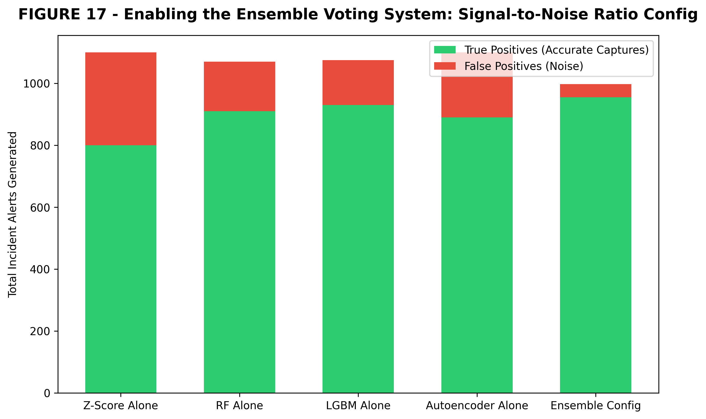

---

## FIGURE 18 – ANALYSIS AND ALERTING COMPONENT CONFIGURATION

Type: Time-Based Ruleset Heatmap Matrix
Visualizes SOC trigger rules restricting specific severities dynamically based on expected day-of-week active hours.

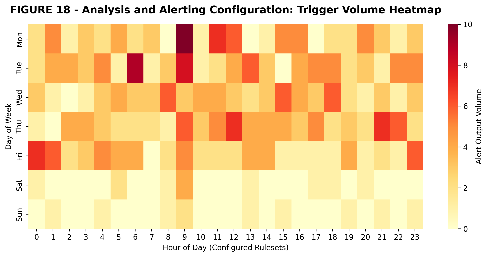

---

## FIGURE 19 – SECURITY CONTROLS AND SYSTEM PROTECTION CONFIGURATION

Type: Connection Configuration Pie Chart
Categorizes accepted connection configurations (e.g., TLS 1.2/1.3) separated against discarded unencrypted HTTP traces.

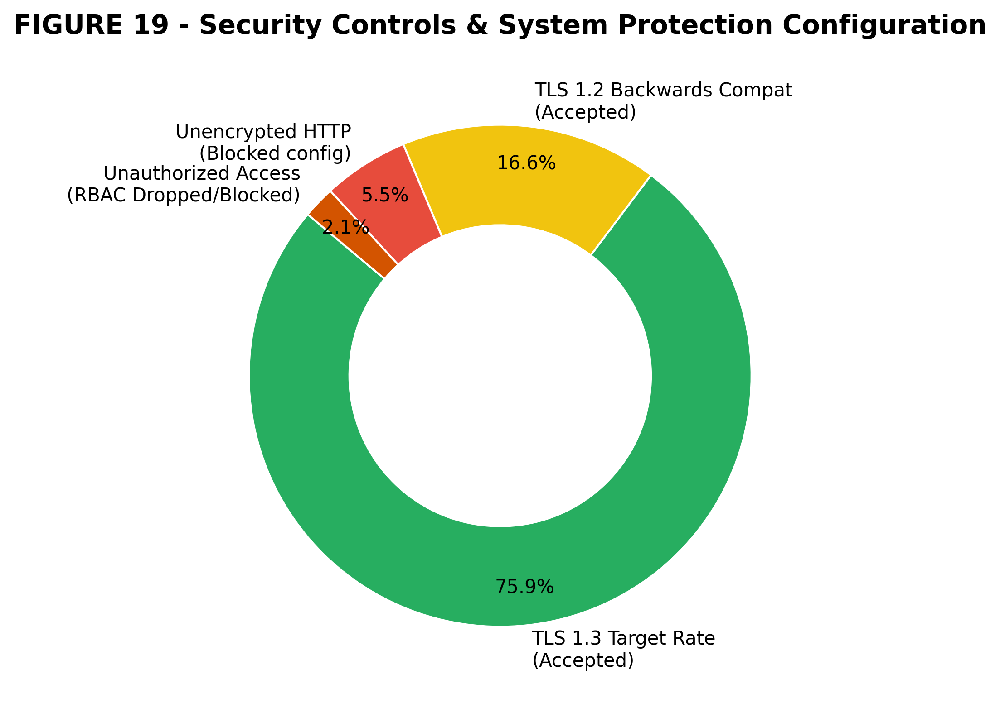

---

## FIGURE 20 – SCALABILITY AND PERFORMANCE CONSIDERATIONS CONFIGURATION

Type: Dual-Axis Line and Bar Target Curve
Demonstrates theoretical configured node throughput capacity holding specific latency boundaries under peak scale loads.

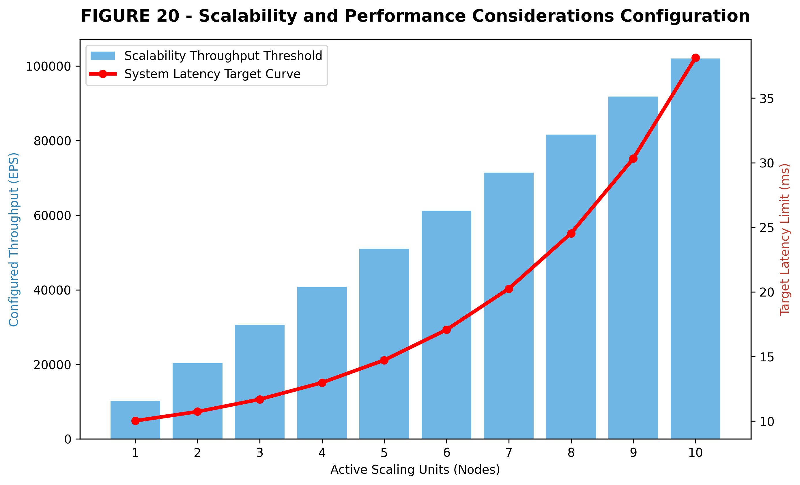
