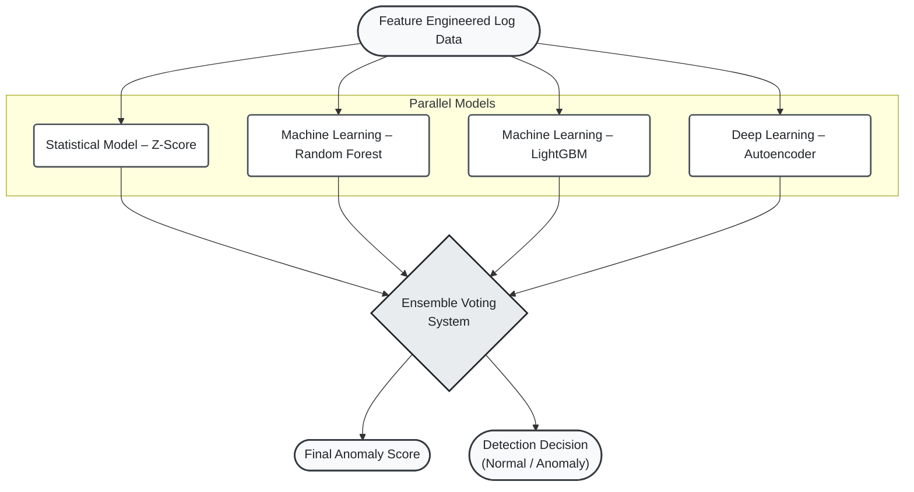
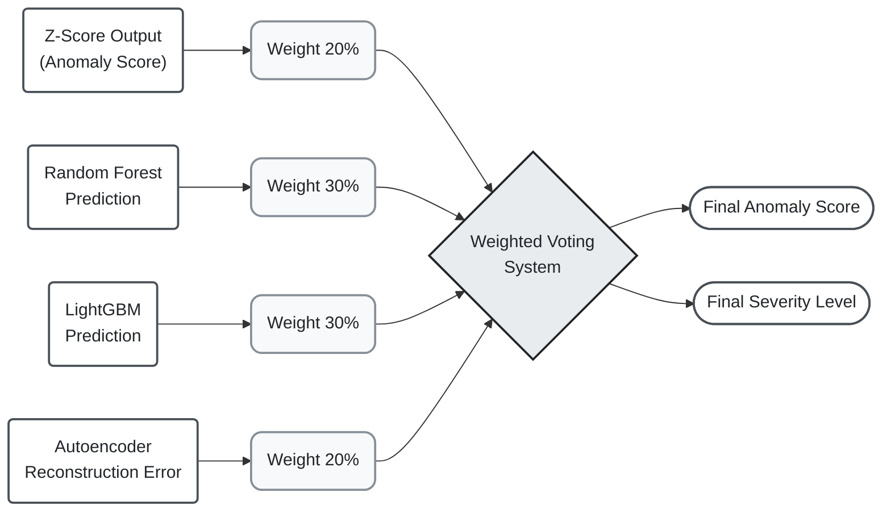
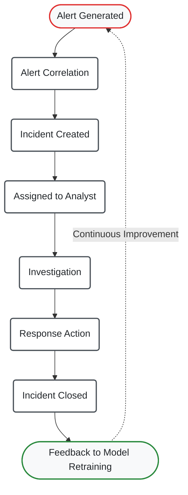

# AI-Sentinel V3 – AI-Based SIEM Platform Diagrams

This document contains a set of professional, academic-style cybersecurity architecture diagrams for the AI-Sentinel V3 project. These diagrams are designed using Mermaid.js and are suitable for inclusion in a graduate-level cybersecurity capstone report. They feature clean layouts, labeled components, and consistent styling.

## FIGURE 1 – OVERALL SYSTEM ARCHITECTURE

This layered architecture diagram illustrates the end-to-end data flow from source ingestion to final storage.

```mermaid
flowchart LR
    classDef layer fill:#f8f9fa,stroke:#adb5bd,stroke-width:2px,color:#212529,rx:8,ry:8;
    classDef component fill:#ffffff,stroke:#495057,stroke-width:1px,color:#212529,rx:4,ry:4;
    classDef db fill:#ffffff,stroke:#495057,stroke-width:1px,color:#212529;

    subgraph L1["1. Data Sources Layer"]
        direction TB
        D1("User Login Logs"):::component
        D2("Authentication Logs"):::component
        D3("System Logs"):::component
        D4("Network Logs"):::component
    end

    subgraph L2["2. Ingestion Layer"]
        direction TB
        I1("TLS Secure API"):::component
        I2("Log Parser"):::component
        I3("Feature Extraction Engine"):::component
        I1 --> I2 --> I3
    end

    subgraph L3["3. Detection Engine Layer"]
        direction TB
        E1("Statistical Detection<br/>(Z-Score)"):::component
        E2("Machine Learning Models<br/>(Random Forest, LightGBM)"):::component
        E3("Deep Learning Model<br/>(Autoencoder)"):::component
        E4("Ensemble Voting System"):::component
    end

    subgraph L4["4. Analysis & Alerting Layer"]
        direction TB
        A1("Severity Scoring Engine"):::component
        A2("SHAP Explainability"):::component
        A3("MITRE ATT&CK Mapping"):::component
        A4("Threat Intelligence Enrichment"):::component
        A1 --> A2 --> A3 --> A4
    end

    subgraph L5["5. Incident Management Layer"]
        direction TB
        M1("Alert Correlation"):::component
        M2("Incident Ticketing"):::component
        M3("SOC Analyst Dashboard"):::component
        M1 --> M2 --> M3
    end

    subgraph L6["6. Storage Layer"]
        direction TB
        S1[("Log Database")]:::db
        S2[("Alert Database")]:::db
        S3[("Model Registry")]:::db
    end

    L1 --> L2
    L2 --> L3
    L3 --> L4
    L4 --> L5
    L5 --> L6
    
    class L1,L2,L3,L4,L5,L6 layer;
```

## FIGURE 2 – DETECTION ENGINE ARCHITECTURE

This diagram details the machine learning detection pipeline, showing parallel model execution merging into an ensemble.

## FIGURE 3 – ANALYSIS AND ALERTING PIPELINE

A sequential workflow diagram depicting how raw detection outputs are enriched and operationalized into actionable SOC events.

```mermaid
flowchart LR
    classDef step fill:#ffffff,stroke:#495057,stroke-width:2px,color:#212529,rx:4,ry:4;
    classDef startNode fill:#f8f9fa,stroke:#2b8a3e,stroke-width:2px,color:#212529,rx:15,ry:15;
    classDef endNode fill:#f8f9fa,stroke:#c92a2a,stroke-width:2px,color:#212529,rx:15,ry:15;

    P1(["Detection Output"]):::startNode
    P2("Severity Scoring"):::step
    P3("SHAP Explainability"):::step
    P4("MITRE ATT&CK Mapping"):::step
    P5("Threat Intelligence<br/>Enrichment"):::step
    P6("Alert Generation"):::step
    P7("Incident Creation"):::step
    P8(["SOC Dashboard"]):::endNode

    P1 --> P2 --> P3 --> P4 --> P5 --> P6 --> P7 --> P8
```

## FIGURE 4 – ENSEMBLE VOTING SYSTEM

This diagram breaks down the inputs and weighted calculation mechanics of the ensemble voting system.

## FIGURE 5 – INCIDENT MANAGEMENT WORKFLOW

A continuous loop diagram showing the SOC analyst response workflow and the resulting feedback loop for ML retraining.

