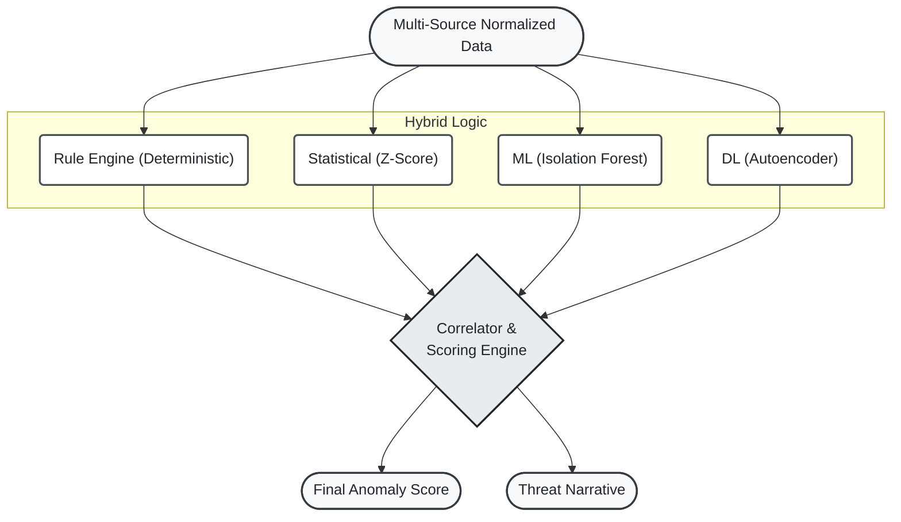
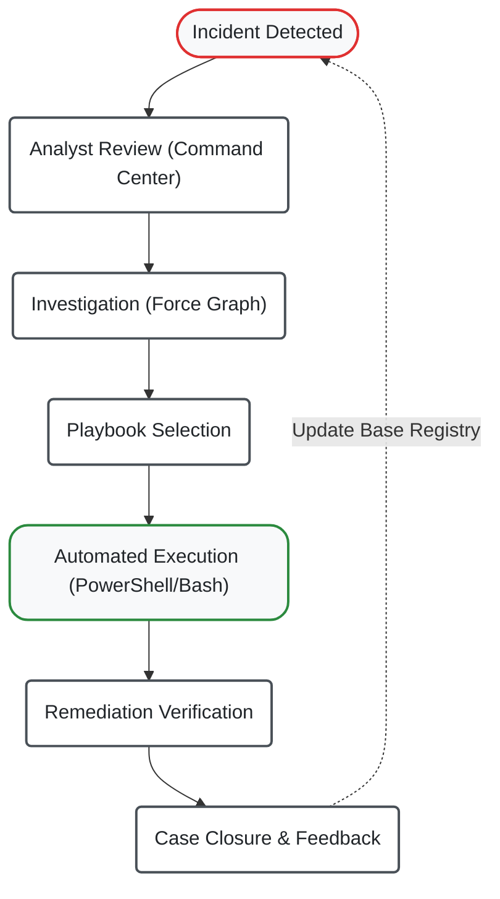

# AI-Sentinel V4 – AI-Based SIEM Platform Diagrams

This document contains a set of professional, academic-style cybersecurity architecture diagrams for the AI-Sentinel V4 project. These diagrams are designed using Mermaid.js and are suitable for inclusion in a graduate-level cybersecurity capstone report.

## FIGURE 1 – OVERALL V4 SYSTEM ARCHITECTURE

This layered architecture diagram illustrates the end-to-end data flow from multi-source ingestion to the React-based dashboard.

```mermaid
flowchart LR
    classDef layer fill:#f8f9fa,stroke:#adb5bd,stroke-width:2px,color:#212529,rx:8,ry:8;
    classDef component fill:#ffffff,stroke:#495057,stroke-width:1px,color:#212529,rx:4,ry:4;
    classDef db fill:#ffffff,stroke:#495057,stroke-width:1px,color:#212529;

    subgraph L1["1. Multi-Source Ingestion"]
        direction TB
        D1("Windows Events"):::component
        D2("Syslog / Auth"):::component
        D3("Network Flows"):::component
        D4("Endpoint Telemetry"):::component
    end

    subgraph L2["2. Processing Layer"]
        direction TB
        I1("FastAPI Secure Ingestion"):::component
        I2("Ingestion Manager / Parsers"):::component
        I3("Pandas Feature Extraction"):::component
        I1 --> I2 --> I3
    end

    subgraph L3["3. Hybrid Detection Stack"]
        direction TB
        E1("Rule-Based Heuristics"):::component
        E2("Statistical Baselining"):::component
        E3("Ensemble ML Models"):::component
        E4("Lateral Movement Scanning"):::component
    end

    subgraph L4["4. XAI & Narrative Layer"]
        direction TB
        A1("Dynamic Severity Scoring"):::component
        A2("SHAP explainability Engine"):::component
        A3("MITRE ATT&CK Mapping"):::component
        A4("Case File Generation"):::component
        A1 --> A2 --> A3 --> A4
    end

    subgraph L5["5. Incident & Automation"]
        direction TB
        M1("Incident Correlation"):::component
        M2("Interactive Playbooks"):::component
        M3("React SOC Dashboard"):::component
        M1 --> M2 --> M3
    end

    subgraph L6["6. Persistence Layer"]
        direction TB
        S1[("Normalized Events DB")]:::db
        S2[("Incident/Alert DB")]:::db
        S3[("Model Registry")]:::db
    end

    L1 --> L2
    L2 --> L3
    L3 --> L4
    L4 --> L5
    L5 --> L6
    
    class L1,L2,L3,L4,L5,L6 layer;
```

## FIGURE 2 – V4 DETECTION PIPELINE

This diagram details the machine learning and rule-based detection pipeline used in V4.

## FIGURE 3 – INCIDENT RESPONSE & PLAYBOOK WORKFLOW

A continuous loop showing the integration of manual intervention and automated playbooks in V4.

