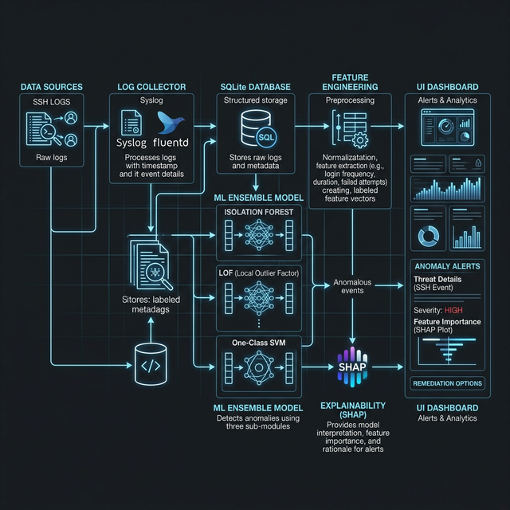
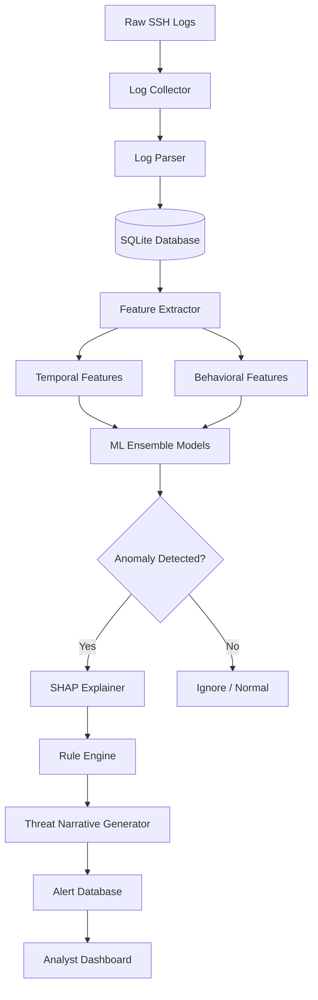
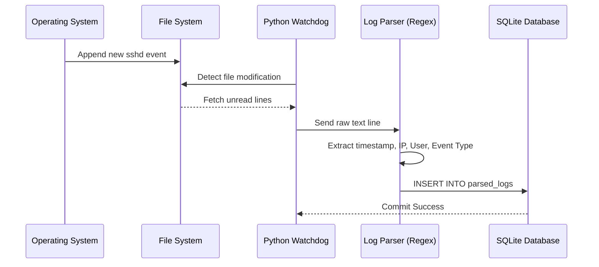
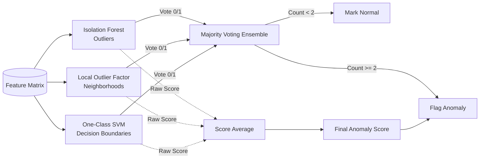
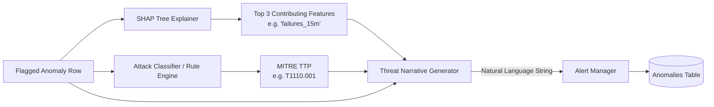

# AI-Sentinel Architecture Diagrams

## 1. System Architecture Overview
The overall high-level architecture of the AI-Sentinel platform.

## 2. Processing Pipeline Flowchart
The chronological data flow of an SSH log through the entire SIEM platform.

## 3. Ingestion Layer Architecture
A zoomed-in view of how un-structured logs are converted and stored continuously.

## 4. Machine Learning Detection Layer
The voting ensemble mechanism used for robust anomaly detection.

## 5. Explainability and Alerting Layer
How a flagged anomaly is translated into a MITRE ATT&CK technique and human-readable narrative.

