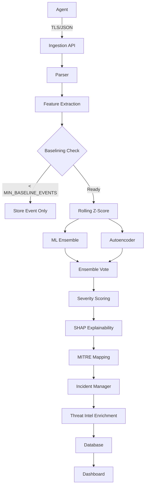

# Upgrading AI-Sentinel to an Enterprise-Style SIEM Platform

This document outlines the detailed plan to achieve the V3 mission: transforming the existing prototype into a production-grade SIEM with advanced ML capabilities, incident workflows, robust background processing, enterprise dashboards, and strict architecture constraints.

## Global Architecture

The pipeline will strictly follow this flow:

## User Review Required

> [!IMPORTANT]
> The database changes are extensive and require migrating from the current `_SCHEMA_SQL` paradigm entirely to a migrations-based approach. Since SQLite doesn't natively support easy ALTER DROP, we will reconstruct tables as part of the initial migrations. 
> Since we're dealing with strict schemas, a V2 DB shouldn't be read using V3 structures directly without migration.

## Proposed Changes

### `ai_sentinel/config.py`
[MODIFY] Add requested config settings like `REQUIRE_TLS`, `MIN_BASELINE_EVENTS`, `INCIDENT_WINDOW_MINUTES`, `DEVICE_ONLINE_THRESHOLD_MINUTES`, `FP_RATE_THRESHOLD`, `SEVERITY_THRESHOLDS`, `DATA_RETENTION_DAYS`, `ABUSEIPDB_API_KEY`, `JWT_SECRET`, `PSI_DRIFT_THRESHOLD`, `METRICS_AGGREGATION_INTERVAL_MINUTES`. Ensure all can override via `os.getenv()`.

---

### Database Schema and Migrations
We will create a migration runner in `ai_sentinel/storage/migrations.py`.
[NEW] `ai_sentinel/storage/migrations/001_initial_v3_schema.sql` (Creates all tables listed in the mandate, including the `is_stale BOOLEAN DEFAULT FALSE` column in the `model_registry` table.)
[MODIFY] `ai_sentinel/storage/database.py` to trigger the migration runner instead of the raw `_SCHEMA_SQL` execution. Add new CRUD functions matching the new schema requirements (incidents, anomalies, heartbeats, users/roles).

---

### 1. Model Persistence & Cold Start
[MODIFY] `ai_sentinel/models/base_model.py` and implementors (`ensemble_model.py`, `autoencoder_model.py`, etc.) to support `save()` and `load()` methods using `joblib` and `torch.save`.
[MODIFY] `server.py` startup handlers to load or retrain models. Record metadata in `model_registry` table.
[MODIFY] Pipeline logic to skip detection for `BASELINING` devices.
[NEW] `POST /admin/retrain` endpoint in `server.py`.

---

### 2. Incident Management System
[NEW] `ai_sentinel/detection/incident_manager.py` with `IncidentManager` to handle grouping anomalies into instances using `(device_id, source_ip, attack_type)` within the `INCIDENT_WINDOW_MINUTES`.
[NEW] API endpoints `POST /incidents/{id}/status` and `POST /incidents/{id}/assign` with RBAC decorators.

---

### 3. TLS Enforcement
[NEW] `ai_sentinel/tls_middleware.py` -> Add a FastAPI middleware to enforce HTTPS.
[MODIFY] The template/example config used during onboarding will be modified. The agent's config loader (`windows_agent_simulator.py`, `linux_agent.py`) will be updated to handle missing TLS fields gracefully with safe defaults (`tls_verify: false`, `ca_cert_path: null`). `agent_config.yml` itself is .gitignored.
[MODIFY] Warn on dashboard if not `REQUIRE_TLS`.

---

### 4. Role-Based Access Control (RBAC)
[NEW] `ai_sentinel/auth.py` to manage JWT creation, and provide FastAPI dependencies like `require_role()`.
[MODIFY] API endpoint definitions to use `Depends(require_role("ADMIN"| "ANALYST"))`.
[NEW] `ai_sentinel/ui/pages/admin.py` -> Streamlit page.

---

### 5. SHAP Explainability & Threat Intelligence
[MODIFY] If `ai_sentinel/explainability/shap_aggregator.py` exists, refactor it in place. If not, create it. Either way, ensure the old SHAP import path in `threat_narrative.py` and the detection pipeline is updated to point to the new weighted aggregation function.
[MODIFY] `ai_sentinel/explainability/threat_narrative.py` or rule engine to output MITRE confidence based on SHAP values.
[NEW] `ai_sentinel/explainability/threat_intel.py` to handle async requests to AbuseIPDB. Background querying using `FastAPI BackgroundTasks`. Cache to SQLite.

---

### 6. Test Suite
[NEW] `pytest.ini` at the root directory.
[NEW] `tests/fixtures.py` must contain: a mock `LogEvent` dataclass, a mock `AnomalyRecord`, a pre-built feature matrix (10 rows, 8 features), a mock `IncidentManager` with pre-seeded open incidents, and a mock `httpx` response for AbuseIPDB returning confidence score 85.
[NEW] `tests/test_detection_pipeline.py`, `tests/test_api_endpoints.py`, `tests/test_agent.py`, `tests/test_explainability.py`. Implement logic testing, mock DB returns, verify ensemble voting, SHAP behavior, API routes, and agent behaviors.

---

### 7. Docker Deployment
[NEW] `Dockerfile`
[NEW] `docker-compose.yml` (api, dashboard, agent-sim)
[NEW] `docker-compose.override.yml` (dev mode overrides)
[NEW] `.env.example`

---

### 8. SOC Dashboard
[NEW] `ai_sentinel/ui/components/chart_theme.py`, `kpi_card.py`, `severity_badge.py`, `sidebar_filters.py`, `auto_refresh.py`
[NEW] `ai_sentinel/ui/data_layer.py`. This must expose specific cached functions: `get_metrics_timeseries(device_id, start, end)` -> queries `metrics_5min`; `get_open_incidents(filters)` -> queries `incidents`; `get_anomalies_for_incident(incident_id)` -> queries `anomalies + events` join; `get_shap_for_anomaly(anomaly_id)` -> reads JSON from `anomalies.shap_values`. All others default to raw queries only if no `metrics_5min` equivalent exists.
[MODIFY] `ai_sentinel/ui/dashboard.py` (Navigation root, session config)
[NEW] `ai_sentinel/ui/pages/live_alerts.py`, `ai_sentinel/ui/pages/threat_intel.py`, `ai_sentinel/ui/pages/device_behavior.py`, `ai_sentinel/ui/pages/model_analytics.py`, `ai_sentinel/ui/pages/analytics.py`
[NEW] `ai_sentinel/ui/utils/report_generator.py` — uses `fpdf2`. Add `fpdf2` and `plotly` (with `kaleido` for `to_image`) to `requirements.txt`. `kaleido` is required for `plotly.io.to_image` to work headlessly inside Docker.

---

### 9. Severity Scoring
[NEW] `ai_sentinel/detection/severity.py` -> Implement formula.
`compute_severity_score()` must be injected into the existing pipeline orchestration file inside `ai_sentinel/detection/`. Identify the correct file by finding where the ensemble vote result is currently consumed. If no single orchestration file exists, create `ai_sentinel/detection/pipeline.py` and consolidate the pipeline flow there. The severity score and label must be passed into the SHAP context so the narrative can reference severity.

---

### 10. Device Heartbeats
[NEW] `POST /heartbeat` endpoint. Table `device_heartbeats`. Agent simulator to ping it.

---

### 11. Metrics Pre-Aggregation
[NEW] `ai_sentinel/storage/metrics_aggregator.py` -> Upserts data to `metrics_5min`.

---

### 12. Background Job System
[NEW] `ai_sentinel/jobs/scheduler.py` -> Hooks up `APScheduler`. Integrates into `server.py` lifecycle. Runs metrics gathering, device online status checks, TTL expirations.
[NEW] `ai_sentinel/jobs/geo_resolver.py` — uses `geopy` Nominatim to resolve IPs in `ip_geolocation` where `resolved_at IS NULL`. Rate-limit to 1 request/second to respect Nominatim's ToS.

Jobs to schedule:
| Job | Module | Frequency |
|---|---|---|
| Metrics aggregation | `metrics_aggregator.run()` | Every 5 min |
| Device offline detection | Check heartbeats vs. threshold | Every 2 min |
| Threat intel refresh | Re-query AbuseIPDB for expiring cache rows | Every 24h |
| IP geolocation resolution | `geo_resolver.run()` | Every 24h |
| Feature drift detection | `drift_detector.run()` | Every 24h |
| Data cleanup | Delete rows past retention config | Daily at 02:00 UTC |

---

### 13. Feature Drift Detection
[NEW] `ai_sentinel/detection/drift_detector.py` -> Calculates PSI for models via scheduler task. Stale flags updated in `model_registry`.

---

## Verification Plan

### Automated Tests
Execute `pytest` to run all new unit and integration tests defined in Task 6. Ensure >90% coverage on core detection and API logic. 

### Manual Verification
Execute system tests:
- After 200+ events from agent-sim, device status changes from `BASELINING` to `ONLINE` ✓
- After brute-force simulation (15 failed logins), a single incident is created (not 15 anomaly rows) ✓
- `metrics_5min` has rows within 5 minutes of first events ✓
- PDF export produces a non-zero byte file that opens correctly ✓
- `/admin/retrain` with analyst token returns 403 ✓
- PSI drift table has rows after drift detection job runs manually ✓
